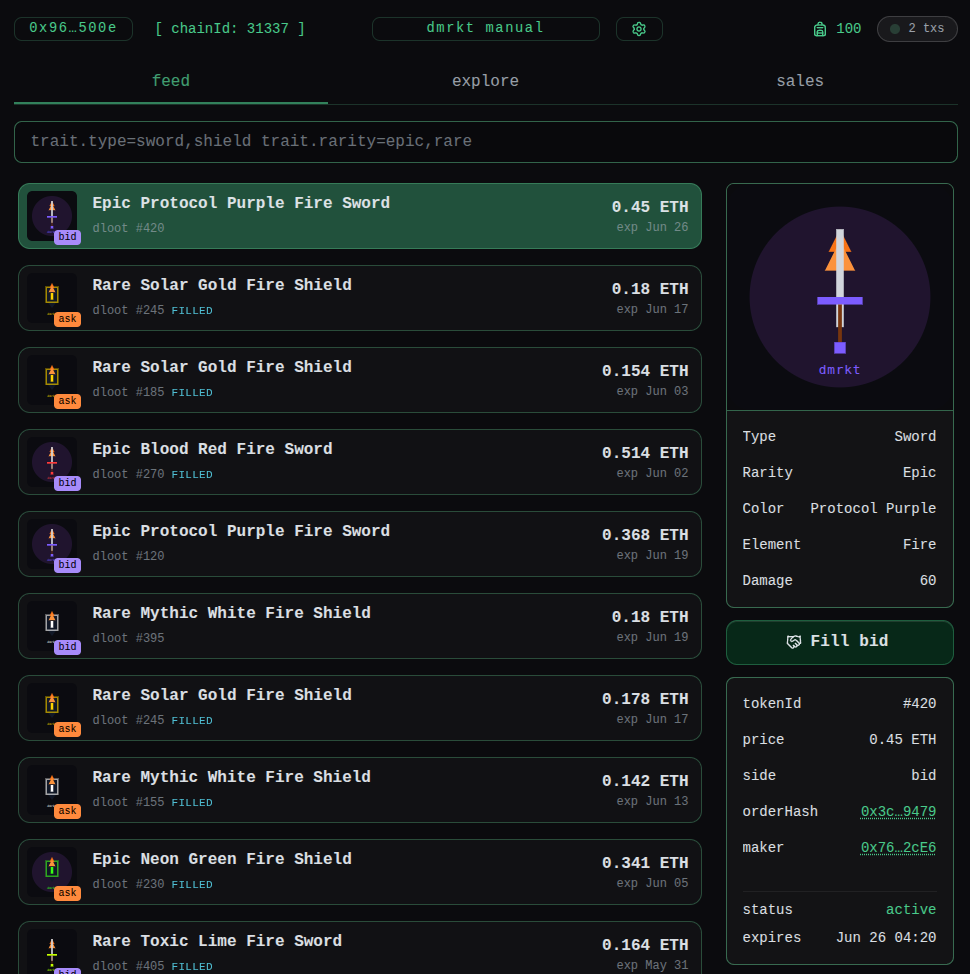

# d | mrkt — seeded NFT marketplace demo

A Web3 ecosystem that forks Ethereum mainnet and simulates ~28 days of activity.

Everything runs via Docker Compose 🐳

**Contents** — [How it works](#how-it-works) · [Getting started](#getting-started) · [Reset](#reset) · [Troubleshooting](#troubleshooting) · [What to improve](#what-to-improve)

**Getting started** — [Prerequisites](#prerequisites) · [VM notes](#vm-notes) · [Environment](#environment) · [Run](#run)

## 

---

## How it works

The demo forks Ethereum mainnet at a block number ~28 days in the past. The timespan from that block to now becomes the simulation window.

The simulation step deploys contracts, generates signed EIP-712 orders and executes trades on a subset of these. For each trade, the forked chain's internal clock is incremented – spreading activity across the simulation window.

Each trade emits a `Settlement` event, which is consumed by a NodeJS indexer and persisted to MongoDB.

A NextJS single-page application displays this data and allows users to create orders, execute trades, and view receipts.

Realtime updates are streamed via WebSocket.

### Services

| Service              | Port               | Role                                        |
| -------------------- | ------------------ | ------------------------------------------- |
| anvil                | `8545`             | Local EVM fork of Ethereum mainnet          |
| [sim][contracts]     | —                  | Contracts + Marketplace activity simulation |
| [indexer][indexer]   | `5000` / `5001 ws` | Indexer + API + WebSocket                   |
| [frontend][frontend] | `3000`             | Marketplace UI                              |
| mongo                | `27017`            | MongoDB database                            |

[contracts]: https://github.com/izcm/dmrkt-contracts
[indexer]: https://github.com/izcm/dmrkt-indexer
[frontend]: https://github.com/izcm/dmrkt-frontend

> [!NOTE]
> Frontend README is not written yet, but will be shortly.

### Flow

```
mainnet RPC
     │  (fork at computed block)
     ▼
  anvil
     │
     ▼
   sim  ──── deploys contracts + simulates activity
     │
     ▼
 indexer ──── indexes events, exposes API + WebSocket
     │
     ▼
 frontend ──── queries API + subscribes to WebSocket
```

### Logs

Simulation logs are found in:

- `out/broadcast/`: Foundry broadcast logs
- `out/sim.log`: Pretty-printed output from the simulation pipeline

---

## Getting started

### Prerequisites

- Make
- Docker + Docker Compose
- A mainnet RPC URL — [Alchemy](https://www.alchemy.com/) works well.
- Authenticated with GitHub Container Registry. If you've pulled from `ghcr.io` before, you're probably fine. If not, see [401 on image pull](#401-on-image-pull) in Troubleshooting.

### VM notes

> Skip this section if you're not running the demo in a virtual machine

- **Disk:** 20 GB minimum. A full setup consumes roughly 14 GB.
- **RAM:** 4 GB minimum. Runtime usage is low, but frontend builds requires some memory.
- **Browser Clipboard API** only works in secure contexts (`https` or `localhost`). When accessing the frontend through the VM IP instead of `localhost`, the app falls back to a manual copy/paste popup.

Set `APP_HOST` in `.env` to the VM's IP:

```env
APP_HOST=192.168.x.x
```

To get the frontend to run in safe context (resolving the clipboard issue), access the demo through SSH port forwarding:

```bash
ssh -L 3000:localhost:3000 user@vm-ip
```

The demo then runs at:

```txt
http://localhost:3000
```

### Environment

Provide `MAINNET_RPC` via `.env` or an exported shell variable:

```
MAINNET_RPC=https://eth-mainnet.g.alchemy.com/v2/YOUR_KEY
```

This is the only variable you have to specify to run the demo. Everything else is either pre-populated or auto-generated.

| File            | What it is                                         |
| --------------- | -------------------------------------------------- |
| `env.example/*` | Service env files — pre-populated, static          |
| `.env.runtime`  | Auto-generated by `make demo-prepare` — don't edit |

### Run

```bash
make dapp
```

`make dapp` runs two steps:

- **prepare** — computes fork start-block and pipeline window, derives the marketplace contract address and writes the results to .toml and .env files
- **up** — starts the services via Docker Compose

All services use pre-built images, except the frontend. It has to be built locally since `NEXT_PUBLIC_*` variables are bundled at build time.

> [!TIP]
> If you have [Foundry](https://book.getfoundry.sh/) installed locally, you can run `make demo-prepare-local && make demo-up` instead to skip the setup container.

Visit `localhost:3000` to watch the pipeline progress; once the trades are done, it'll link you to the marketplace.

The first run pulls and builds images before anything starts. After that, expect another 5 minutes while the pipeline forks mainnet and runs the simulation.

Coffee break? ☕

> [!NOTE]
> At one stage the pipeline may appear to freeze — it hasn't.
>
> The demo NFT collection does not support batch minting, so minting 500 NFTs requires 500 separate transactions. Expect roughly a 90 second pause mid-run.

### Connect as a demo participant

The pipeline revolves around a fixed set of accounts — bootstrapped with ETH, WETH, and NFTs, and used as actors for every trade and listing.

We'll call them the demo participants 👨‍💻

It's recommended to connect as one as you'll own orders and trade history the moment you log in.

The next steps assume config/sim/mnemonic.example.json exists — run make dapp first if it doesn't.

> [!NOTE]
> The mnemonic is generated once and persists across runs; it only changes if the file is deleted or becomes invalid.
>
> Demo users are derived from the mnemonic and used as inputs to the simulation pipeline. A new mnemonic therefore produces a different dataset.

In your browser:

1. Create a fresh browser profile and install the MetaMask extension.

2. Open MetaMask and select:

   `I have an existing wallet` → `Import using Secret Recovery Phrase`

3. Paste the mnemonic from [mnemonic.json](./config/sim/mnemonic.example.json).

4. Choose a password.

`Account 1` will be the first address derived from the mnemonic.

To connect as another demo participant, click `+ Add account`. Each added account derives the next address from the same mnemonic.

One of the strengths of the frontend application is its keyboard accessibility. If you're a keyboard user, I strongly recommend having MetaMask in `Popup` mode:

1. Inside the MetaMask extension; click the hamburger menu icon

2. Select `Switch to popup`

> [!TIP]
> To see WETH balance in MetaMask, add the anvil network to your wallet and import the token at `0xc02aaa39b223fe8d0a0e5c4f27ead9083c756cc2`

Once the demo is running, visit `localhost:3000` and connect with MetaMask. Go to the `feed` tab and search for:

```txt
maker=me status=active
```

If everything worked correctly, you should see your active orders along with the `Cancel order` action button.

After having a look around, maybe you'll agree with me that [ERC-1155 is a better fit for a gaming collection](#erc-1155-is-a-better-fit-for-a-gaming-collection).

---

## Reset

```bash
make demo-reset
```

Tears down all containers and volumes. Safe to re-run `make dapp` after.

---

## Troubleshooting

> [!IMPORTANT]
> Always run `make demo-reset` before troubleshooting.

### 401 on image pull

Docker needs access to `ghcr.io`.

Generate a GitHub Personal Access Token with `read:packages`, then:

```bash
docker login ghcr.io
```

Use your GitHub username and the token as password.

### DNS / RPC lookup failure during setup

RPC calls occasionally fail during setup.

Just run:

```bash

make demo-reset && make dapp
```

Until it works.

### Frontend stuck loading or transactions never confirm

Another local process is likely occupying a required port.

| Port   | Used for    |
| ------ | ----------- |
| `3000` | frontend    |
| `5000` | indexer API |
| `8545` | anvil RPC   |

Check active processes:

```bash
lsof -i :3000
lsof -i :5000
lsof -i :8545
```

Kill the conflicting process, then:

```bash
make demo-reset
make dapp
```

### Frontend `explore` tab shows no NFTs

`FORK_START_BLOCK` mismatch.

Re-run:

```bash
make demo-prepare
```

---

## What to improve

### ERC-1155 is a better fit for a gaming collection

As the demo moved into a gaming theme, where each NFT represents a game asset, I realized ERC-1155 would be a better fit than ERC-721.

To see why, open the `explore` tab and search for:

```
trait.type=sword trait.rarity=common trait.color=blood_red trait.element=none
```

This returns ~30 identical-looking swords. In the current ERC-721 collection, each of these is a separate NFT, meaning every sword is treated as a unique asset with a unique `tokenId`. It works, but doesn’t fit our use case well.

With ERC-1155, instead of one `tokenId` per sword, a single id could represent the item (e.g. "Common Blood Red Sword"), with balances tracked per user; `balanceOf(owner, id)`.

That way, a user’s swords are just their balance of that item, rather than many separate tokens.

The marketplace contract would also need to be extended to support ERC-1155 orders.

### Long pauses mid-run

The pipeline hangs up for a long time during one specific stage — minting nfts to the demo participants.

If the demo collection followed a standard that supports batch minting, we could have one transaction per participant, instead of the current 500 transactions needed to mint each `tokenId`.

Batch minting is part of the ERC-1155 standard.

### Button flicker in `feed` tab

The action button briefly displays `Pending...` before resolving to its enabled or disabled state. Since transaction simulation only starts when a user selects a row, the button visibly flickers.

This could be improved by pre-simulating transactions.

---

If you had any issues running the demo, or just want to talk web3 infra, feel free to reach out on my [discord](https://discord.com/users/745594868826505227).

**See ya 👾**
